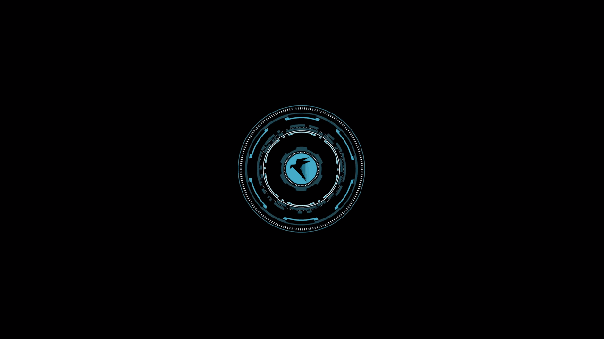
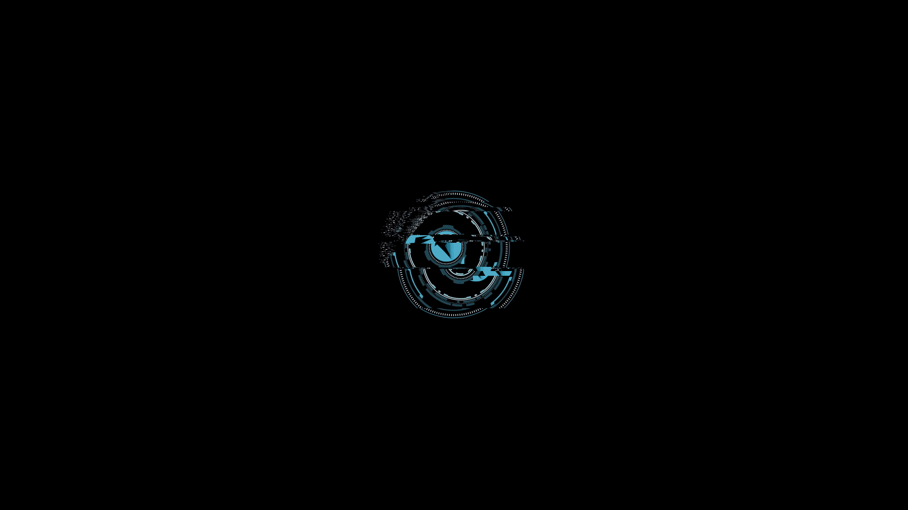

# Parrot Lock Animation for KDE Plasma 6



The Parrot OS `parrot6` Plymouth boot animation, packaged as a self-contained KDE Plasma 6 wallpaper plugin. It works as both a desktop wallpaper and a KDE lock-screen wallpaper.

## Download

- [KDE Store](https://store.kde.org/p/2366104/)
- [GitHub release v1.0.1](https://github.com/digyear/parrot-lock-animation-kde/releases/tag/v1.0.1)

> [!NOTE]
> KDE Plasma 6 implements lock-screen backgrounds through the same `Plasma/Wallpaper` plugin system used by the desktop. Installing this plugin makes it available in both selectors, but the desktop and lock-screen choices are stored independently. Changing the desktop wallpaper does not remove the lock-screen animation.

## Features

- deterministic 33-frame PNG animation; no video codec or Wallpaper Engine dependency;
- native 600×338 rendering on a black canvas, matching the Parrot boot splash;
- usable by Plasma 6 desktop wallpaper settings and `kscreenlocker`;
- fully self-contained after installation.

## Preview



The animation is rendered from the original 33 PNG frames at 20 FPS. It does not require video codecs or an external media player.

## Install

Download `parrot-lock-animation-1.0.1.plasmoid`, then run:

```bash
kpackagetool6 --type Plasma/Wallpaper --install parrot-lock-animation-1.0.1.plasmoid
```

To select it for the KDE lock screen:

```bash
kwriteconfig6 --file kscreenlockerrc --group Greeter --key WallpaperPlugin io.github.digyear.parrotlock
kbuildsycoca6
```

Test without locking the session:

```bash
/usr/lib/x86_64-linux-gnu/libexec/kscreenlocker_greet --testing
```

Uninstall:

```bash
kpackagetool6 --type Plasma/Wallpaper --remove io.github.digyear.parrotlock
```

Before uninstalling an active lock-screen wallpaper, switch back to the standard image plugin:

```bash
kwriteconfig6 --file kscreenlockerrc --group Greeter --key WallpaperPlugin org.kde.image
```

## Build

```bash
./build.sh
```

The package is written to `dist/parrot-lock-animation-1.0.1.plasmoid`.

## Credits and license

- Original animation: Parrot OS `parrot6` Plymouth theme, distributed by the Parrot/Debian `desktop-base` package.
- Plasma wallpaper adaptation: digyear, 2026.
- License: GNU GPL version 3 or later. See [`LICENSE`](LICENSE).

This is a community adaptation and is not an official Parrot Security or KDE product. “Parrot” and related artwork remain attributable to their respective owners.
